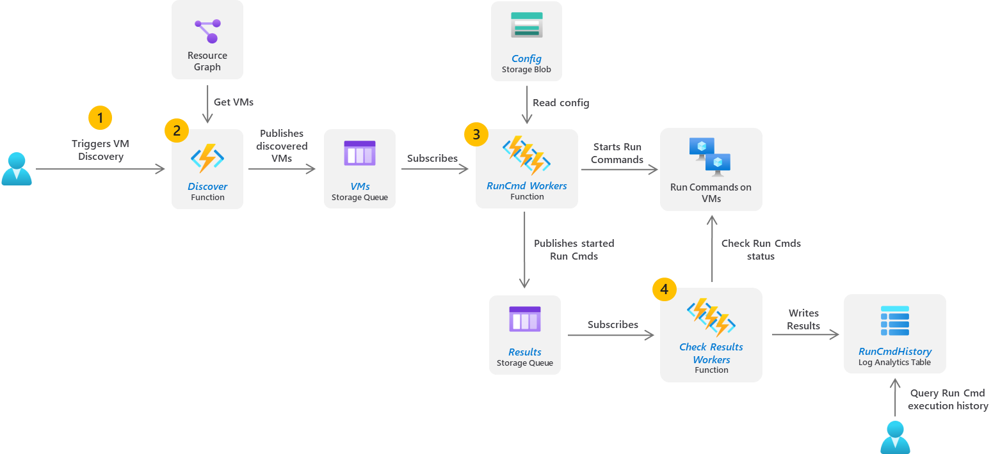
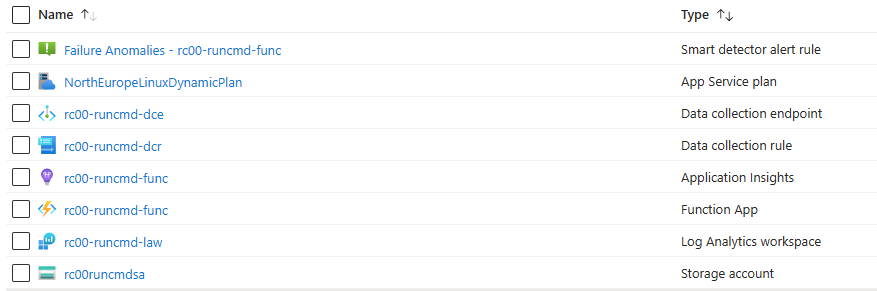

# Run Cmd Solution for Azure

## Architecture

The diagram below describes how this solution works at scale.




## Test locally

Run Function app with:
```
npm run start
```

Customize the `local.settings.json` file with your Azure Storage Account connection string and settings.

Trigger function using:
```
curl --location --request GET 'http://localhost:7071/api/discover'
```

## Create Azure resources

Create a new file `.env` using the template `.env.template` and edit it for customization (e.g., `cp .env.template .env && vi .env`):

```bash
# Prefix for all resources
PREFIX="rc00"

# Existing Resource group name
RESOURCE_GROUP="runcmd"

# Azure region
LOCATION="northeurope"

# Entra/AAD Application Service Principal that will be created for the Azure Function App
APP_NAME="${PREFIX}-runcmd-app"

# Subscriptions array (space separated)
# Example: "11111111-1111-1111-1111-111111111111 22222222-2222-2222-2222-222222222222"
SUBSCRIPTIONS="11111111-1111-1111-1111-111111111111"

```
Run the the script `scripts/create-resources.sh` to create the Azure Resources. This script needs to be executed with App Registration permissions to create the Azure Function App Service Principal.



## Function App configuration
After deploying the Azure resources you need to collect the following values:
- Connection string for your storage account
- Storage account name
- Log ingestion endpoint
- Log ingestion rule immutable id
- The credentials of the new application service principal

Use these collected value to populate the following Azure Fucntion App App settings:
- AzureWebJobsStorage: *"Connection string for your storage account"*
- CONTROL_ACCOUNT_CONN_STRING: *"Connection string for your storage account"*
- CONTROL_ACCOUNT: *"Your storage account name"*
- LOG_INGESTION_ENDPOINT: *"Your log ingestion endpoint"*
- LOG_INGESTION_RULE_IMMUTABLE_ID: *"Your log ingestion rule immutable id"*
- AZURE_TENANT_ID: *"Your tenant id"*
- AZURE_CLIENT_ID: *"Your service principal App id"*
- AZURE_CLIENT_SECRET: *"Your service principal password"*

## Run Cmd scripting configuration
Use the file `config/run-command.json` to define the commands that will be executed by the Run Command. The file is an array of objects with the following structure:

```json
[
    {
        "os": "Windows",
        "cmd": "dir"
    },
    {
        "os": "Linux",
        "cmd": "ls"
    }
]
```

The solution collects this configuration from the Storage account. After customizing this file, you can update it in the storage account using the following script `scripts/update-configuration.sh`. You can change this configuration without the need to redeploy or even restart the Function App.
